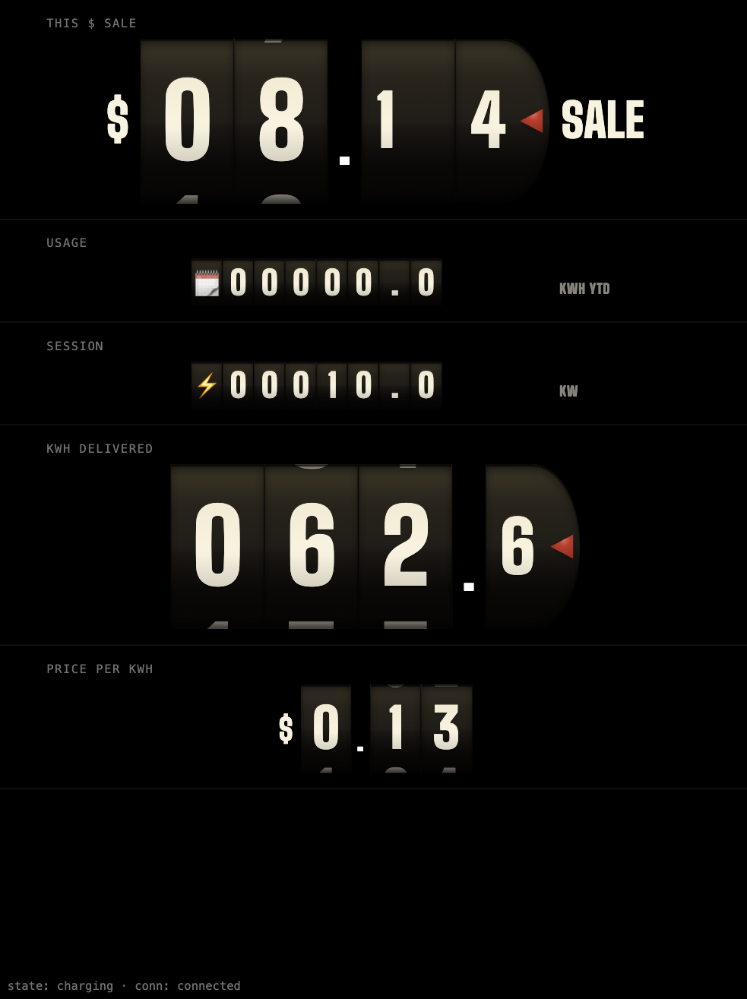

# _Esso Pump EV Charger Conversion_

#### By _**Sean Keane**_

#### Application for pump displays -- 01/22/2025

## Technologies Used

* .NET 8 / ASP.NET Core
* Entity Framework Core
* SQLite (Litestream replication)
* SignalR
* React 18
* TypeScript
* Vite
* Tailwind CSS

## Description

This is a personal project I've undertaken that combines my love for software and hardware.  I am converting a restored 1950s gas pump into an electric vehicle charger.  This project goes beyond charging infrastructure; I plan on replacing the rotary dials with cleverly disguised displays that will output the number of kWh delivered, charge cost (based on my home rates), and other relevant metrics.

I plan to update this README with images and my progress as I tackle the unforeseen challenges of bringing this project to life.

## Restored Pump:

## Update #6 (05/10/2026)

_Phase 5 is complete -- the kiosk display now actually looks like a 1950s gas pump:_

The big visual piece this phase was building the odometer dial component for Zones 1, 4, and 5 -- the chunky vintage-serif rolling digits behind the half-circle D-cap cutouts.  Each digit cell has the mechanical-drum lighting treatment baked in: a warm halogen gradient from the top, symmetric cylinder shading suggesting the cylindrical drum surface curving away from the viewer at top and bottom, soft inset shadows at the window edges where the strip bends out of view, a sharp recessed-cutout shadow at the very top suggesting the cutout is sunk into painted metal, and a 1px drum-seam hairline between adjacent cells.  The rightmost digit on Zones 1 and 4 carries a small worn-red painted-metal pointer arrow rendered as a single radial-gradient SVG with no overlays, and the decimal positions on those dials shrink to ~70% of the integer digits -- period-correct, since real pump tenths drums were physically smaller.

Zones 2 and 3 (USAGE and SESSION) needed a different treatment because the actual faceplate cutouts are long thin horizontal slots, not vertical stacks of square cutouts -- a rolling cylinder doesn't fit that geometry.  I built a `MiniReadout` component as the same visual family (cream digits, dark cells, halogen, cylinder shading, drum seams) but laid out as a fixed 8-cell horizontal row: one emoji cell at the leftmost position followed by 7 character cells.  Every readout always renders 7 characters with leading-zero padding (lifetime kWh of 12.3 displays as `0 0 0 1 2 . 3`, session count of 47 as `0 0 0 0 0 4 7`), so the cell positions never shift between rotations -- only the character inside each cell changes.  The decimal point gets its own cell, consistent with the big dials.

When a rotation cycles, every cell rolls character-by-character from old to new over 250ms with a 30ms left-to-right stagger -- digits, decimal points, colons, blanks, and even the emoji at index 0 all use the same animation.  The unit label cross-fades in its own right-aligned slot.  Zone 2 always rotates between lifetime kWh, year-to-date kWh, and total session count.  Zone 3 pins to live kW while charging, "✓ Done" when complete, "0.0 kW" when plugged but not charging, and rotates through duration and kWh-added when idle.

I also added a `KioskFrame` wrapper that activates with a `?scale=kiosk` URL parameter and locks the viewport to the actual installed display dimensions (768×1024 portrait), CSS-scaled to fit the browser window.  Lets me see what the mounted Pi 5 display will actually show rather than the same content stretched across a desktop browser.  Works on both `/pump` and the `/dev/dials` preview route.

Test count is up to 73 (59 backend + 14 frontend) and CI is green.

Older updates are archived in [UPDATES.md](UPDATES.md).

## Known Bugs

* No known bugs

## License

If you have any questions or concerns feel free to contact me at code@sean-keane.com

*This is licensed under the MIT license*

Copyright (c) 01-22-2025 **_Sean Keane_**
