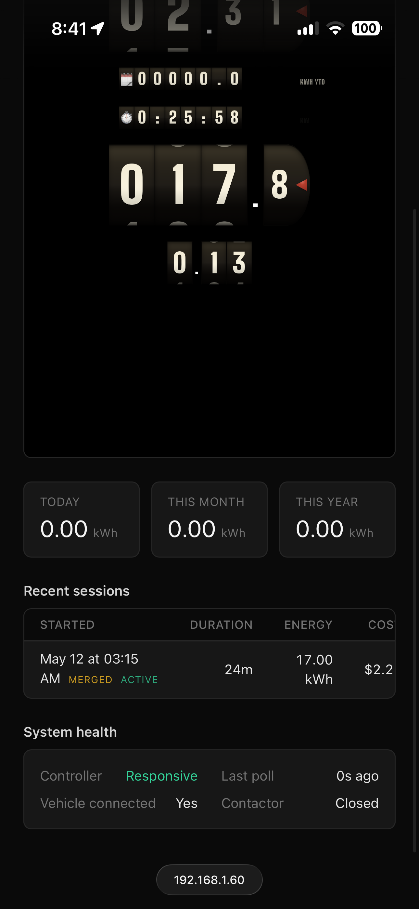
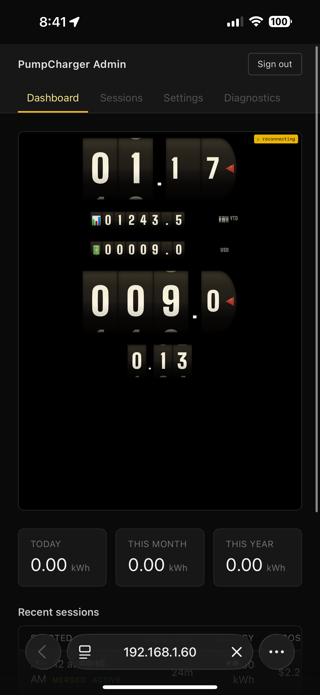

# _Esso Pump EV Charger Conversion_

#### By _**Sean Keane**_

#### Application for pump displays -- 01/22/2025

## Technologies Used

* .NET 8 / ASP.NET Core
* Entity Framework Core
* SQLite (Litestream replication)
* SignalR
* React 18
* TypeScript
* Vite
* Tailwind CSS

## Description

This is a personal project I've undertaken that combines my love for software and hardware.  I am converting a restored 1950s gas pump into an electric vehicle charger.  This project goes beyond charging infrastructure; I plan on replacing the rotary dials with cleverly disguised displays that will output the number of kWh delivered, charge cost (based on my home rates), and other relevant metrics.

I plan to update this README with images and my progress as I tackle the unforeseen challenges of bringing this project to life.

## Restored Pump:

## Update #8 (05/11/2026)

_Phase 7 admin UI -- auth, dashboard, and the kiosk view on a phone:_

  
  

_Admin dashboard rendering on iPhone over LAN.  Embedded kiosk view scales to fit, recent sessions and system health visible below._

Three pieces have landed across Phase 7 so far.

**Backend auth.**  BCrypt password hashing (work factor 11), cookie-based session auth (HttpOnly + SameSite=Strict + Secure-in-production), and a per-IP sliding-window rate limiter that locks an IP out for 15 minutes after 5 failed attempts.  Audit log entries on password setup, login, logout, and lockout events.  Cookie auth normally redirects 401s and 403s to `/Account/Login` and `/Account/AccessDenied`; for a JSON API both events are overridden to return raw status codes instead.  First-run flow is gated by a `hasPassword` flag on `GET /api/auth/status` -- the frontend reads it and decides between the setup form and the sign-in form.

**Frontend auth.**  A zustand auth store, a `useAuth` hook wrapping login/setup/logout/refreshStatus, and an `AdminShell` guard that fans out into loading view → setup redirect → login redirect → protected children depending on store state.  Login surfaces wrong-password vs locked-out via different messages.  Setup requires 8+ characters and a matching confirmation before hitting the API.  Remember-device on login extends the cookie to 30 days; default is browser-session only.

**Admin dashboard.**  `/admin` renders the existing kiosk view component verbatim inside a responsive scaling wrapper -- the same 768×1024 portrait layout that drives the physical pump display, just scaled down to fit whatever viewport it lands in.  On a phone that comes out to roughly 50% scale and the vintage aesthetic survives the resolution change intact, which validates that the kiosk view isn't coupled to the kiosk-only viewport.  Below the embedded display: today/month/year energy totals as stat cards, the most recent 5 sessions in a table with merged/active indicators, and a system health card with controller responsiveness, last poll time, vehicle-connected, and contactor state.  Live state flows through the existing unauthenticated `/hubs/pump` SignalR connection (the same one the kiosk uses); supplementary data fetches `/api/admin/dashboard` (AdminOnly) on mount and every 60s.  No new admin SignalR hub yet -- that comes later when the diagnostics surface needs richer live data.

Test count is up to 185 (86 backend + 99 frontend) and CI is green.

Older updates are archived in [UPDATES.md](UPDATES.md).

## Known Bugs

* No known bugs

## License

If you have any questions or concerns feel free to contact me at code@sean-keane.com

*Copyright © 01-22-2025 **_Sean Keane_**. All rights reserved. This code is published for portfolio review purposes only; no permission is granted for use, modification, or redistribution.*
